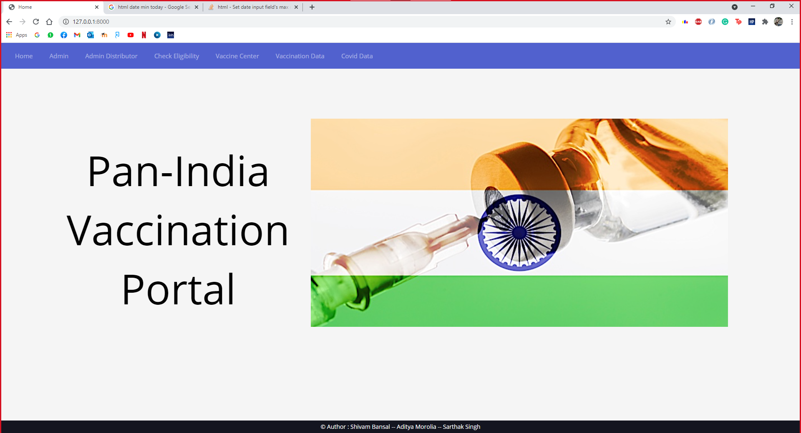
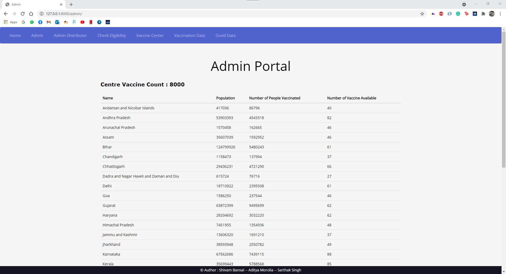
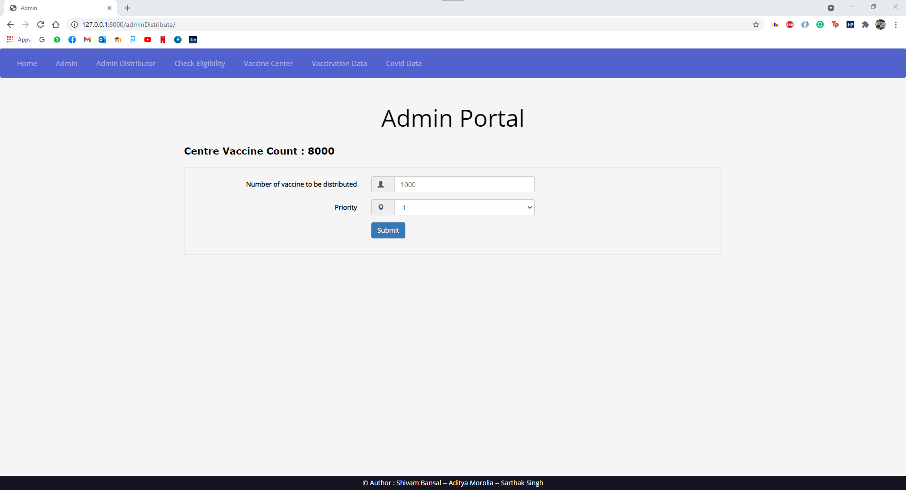
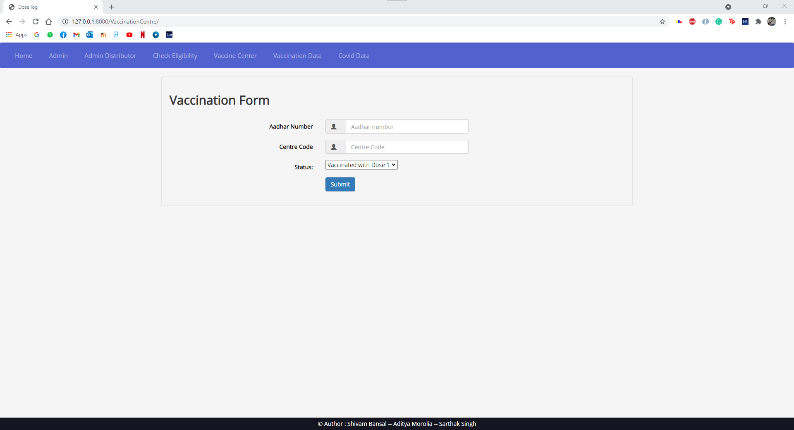
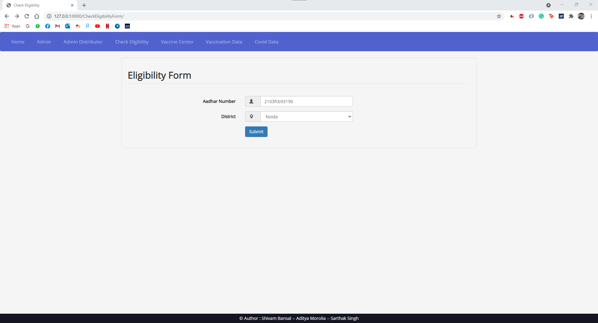
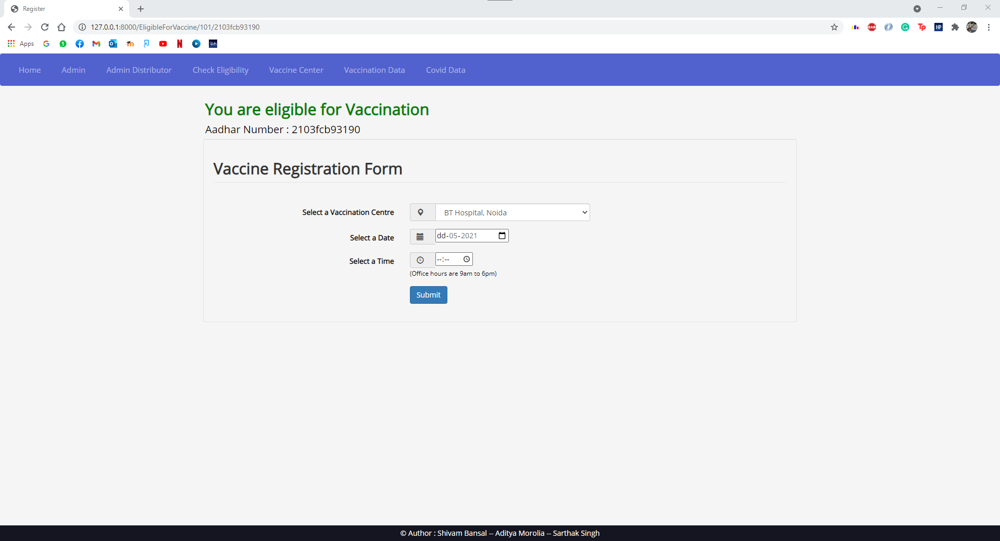
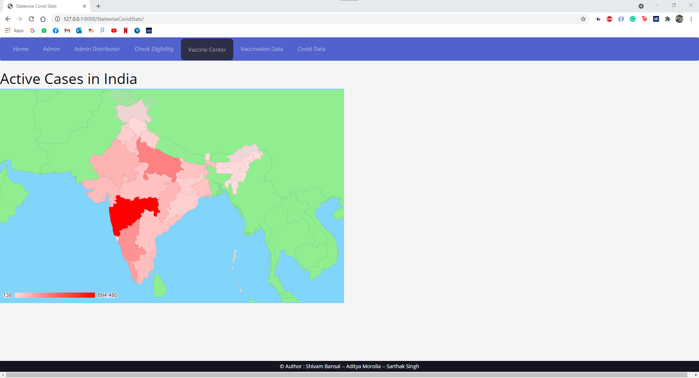
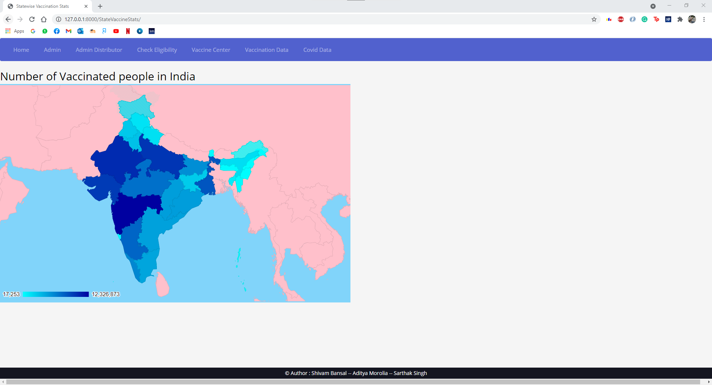
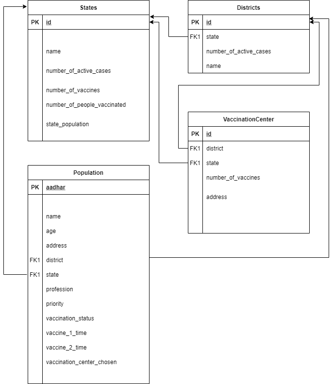

# Pan India Vaccination

## Authors

- Shivam Bansal  - 20171001
- Aditya Morolia - 20171177
- Sarthak Singh   - 20171118

---

## Introduction

Vaccine drives are expensive tasks, requiring many man-hours of planning and execution to achieve the desired task, often saving millions of human lives. In the past, the world has seen huge success while running huge vaccination drives for smallpox, polio, and many other such diseases, eliminating many of them along the way. We take the example of the ongoing challenge of vaccinating people for the COVID-19 infection to demonstrate some of the ways in which IT can help with the huge vaccination drive.

The development and widespread use of an effective SARS-CoV-2 vaccine could help prevent substantial morbidity and mortality associated with COVID-19 infection and mitigate many of the secondary effects associated with non-pharmaceutical interventions. The limited availability of an effective and licensed vaccine will task policymakers around the world, including in India, with decisions regarding optimal vaccine allocation strategies. [1] Here we present a web app that can help us manage the vaccination drive, by keeping track of various stages of the drive, helping in the analysis and planning of the drive, and deciding on a fair scheme to distribute vaccines from the center to various vaccination centers in the country.

### About the vaccination drive and our algorithm

Limited initial supply of severe acute respiratory syndrome coronavirus 2 (SARS-CoV-2) vaccine raises the question of how to prioritize available doses. In a mathematical model, a highly effective transmission-blocking vaccine prioritized to adults ages 20 to 49 years minimized cumulative incidence (symptomatic cases), but mortality and years of life lost were minimized in most scenarios when the vaccine was prioritized to adults greater than 60 years old. [2] Here, we assume that the population is distributed in 4 categories, labeled from $\{1, 2, 3, 4\}$, and at each stage of the vaccination drive, for stage $i$, all the people with a priority $\leq i$ are eligible to receive a vaccine. This could correspond to stage 1 being vaccinating the front line workers, 2 to the elderly, and so on, or it could be something more complicated. The app is structured such that we can handle all of these scenarios with little modification. 

We then formulate an algorithm to distribute a limited supply of $n$ vaccines from a vaccine store (which can be the central government or the state government) to a target set (various state governments or districts.) We then use an implementation of this in our portal to automate vaccine distribution from the center to the states. Due to the modularity of the codebase, this can easily be translated to be used in other situations, such as extending the use case by adding a feature to distribute the vaccines received by a state to the various districts in the state. 

### Algorithm to find a distribution of $n$  vaccines from a central store among $m$  states

Let $\{s_1, s_2, \ldots s_m\}$ be the states. 

We are taking into account the following three variables while distributing vaccines to the states. 

- Population in the current priority group living in the state

    This is given by the number of people in the state with priority `<= CURRENT_PHASE`

    Let this be $p_1, p_2, \ldots p_m$.

    Let $r_{11}, r_{12}, \ldots r_{1m}$ be the fraction of population eligible in the current phase in each state.

    That is, $r_{1i} = \frac{p_i}{\sum_j p_j}$

    This is considered because the state with a higher fraction should be given more vaccines to administer.

- The number of vaccination centres in the state, per unit population

    Let $v_1, v_2, \ldots v_m$ be the number of vaccination centres in each state.

    Then, the variable we take into account is $r_{2i} = \frac{v_i}{p_i}$

- The gradient of the number of active cases of COVID-19 infections in the state.

    To find this, we take the average increment in the number of cases in the state from a previous time instant to the current time instant.

    Let $d_1, d_2, \ldots d_m$ be the difference between the active infections in the states in $k$ days.

    Then, take $r_{3i}  = \frac{d_i}{k}$

Now, we will use a convex mixture of these fractions to find a ratio in which to divide the $m$ vaccines. Let $w_1, w_2, w_3$ be the weights we want to use to combine the ratios $r_1, r_2, r_3$ such that $w_1 + w_2 + w_3 = 1$, then the final ratio will be given as $r = \{ \sum_j w_jr_{ji} \}_i$

We can then divide the $n$ vaccines among the $m$ states in the ratio $r_1, r_2, \ldots r_m$.

### Analysis

- The algorithm runs in time linear in $m$. This is because of the structure of the database, as we designed it such that the required data such as population and number of vaccination centres are stored in the state table itself.
- The implementation that we write for our application is robust enough to handle general structure of the problem formulated above.

---

# Application features

In our application, we have provided several different functionalities for three different groups of people which include the Administrator who controls the supply of vaccines to the states, the Vaccination centers which vaccinate the individuals, and the general public, the citizens who use our platform for various purposes. The features of the general public are common to all, but the administrator and vaccine centers get some exclusive features that are explained below:



## Administrator side

### 1. Analytics

This functionality allows the users (with admin access) to view the statewise statistics of population, the number of people vaccinated, and the number of vaccines available for every state, and other demographic information in a tabular form. 



### 2. Distribute Vaccines or Update Vaccination Phase

Admin gets the stock of vaccines that are to be distributed throughout the country and does so based on our algorithm described in the previous section. This provides effective and efficient distribution of the available vaccines.



## Vaccine Centre side

### 1. Update vaccination status of an individual

Vaccine Centers can also use our platform to update the vaccination status of the individuals (such as registration and admistration of doses, and vaccination cards, etc.)

 

### 2. Keep track of vaccines in store at the centre

This side also allows the centre to keep track of the vaccines available with them. The app detects the number of vaccines, and only displays the centres with the relevant number of vaccines to the people during registration.

## Citizen Side

### 1. Check Eligibility

As mentioned in the introduction, the citizens are divided into various classes, based on their profession (i.e. healthcare workers, doctors, police, etc.) and age (elderlies can be given more priority than the young.) This feature helps to filter out those who can or cannot register for the vaccine. This allows the user to check his eligibility before he actually registers for vaccination.



### 2. Register for vaccine and book an appointment

Those who are eligible can register for a vaccine and book an appointment  time and date in the district of their choice, at their nearest center (users can choose from the centers available in your districts.)

 

### 3. Heatmap Visualizations of demographic data

Important analytics data such as the number of active cases, number of people vaccinated, etc. can be visualised in the form of a heatmap to analyse and improve the vaccine drive. This feature updates dynamically when a new person is vaccinated in a particular state and the vaccine center updates the status of that person. 





---

# Structure of the web app

We used Django for our web application. Django is a Python-based free and open-source web framework that follows the model-template-views architectural pattern. Django is an MVT web framework used to build web applications. It defines itself as a “batteries included” web framework, with robustness and simplicity to help web developers write clean, efficient, and powerful code.

## Directory Structure

```bash
.
├── cowin_vaccine_data_statewise.csv
├── db.sqlite3
├── demo
│   ├── admin.py
│   ├── apps.py
│   ├── forms.py
│   ├── helpers.py
│   ├── __init__.py
│   ├── migrations
│   ├── models.py
│   ├── __pycache__
│   ├── templates
│   ├── tests
│   ├── tests.py
│   └── views.py
├── Pan-India Vaccination
├── manage.py
├── populate_database.py
├── README.md
├── requirements.txt
├── scripts
│   ├── populate_database.py
│   └── setup.sh
├── state_wise.csv
├── static
│   ├── css
│   ├── files
│   ├── flags
│   ├── fonts
│   ├── images
│   ├── js
│   └── plugins
└── VaccineDistribution
    ├── asgi.py
    ├── __init__.py
    ├── __pycache__
    ├── settings.py
    ├── urls.py
    └── wsgi.py

16 directories, 23 files
```

- **demo** - main django application
    - [forms.py](http://forms.py) - contain structures for handling form enteries in the application
    - [helper.py](http://helper.py) - contains methods that help in computation and communicates with the database. It makes the code structure modular.
    - [models.py](http://models.py) - Each attribute of the model represents a database field. It provides the structure of database table schemas.
    - [views.py](http://views.py) - A view function is simply a Python function that takes a Web request and returns a Web response. Helps inform response handling also.
- **statics** - This folder contains all the assets files like images, styling(css) files, and javascript files, csv data files, etc.
- **VaccineDistribution -** Django wrapper to connect backend with the frontend templates.

## Design of the Database



---

# References

[1 Vaccination allocation strategies]([https://www.medrxiv.org/content/10.1101/2020.11.22.20236091v1.full](https://www.medrxiv.org/content/10.1101/2020.11.22.20236091v1.full))

[2 Mathematical modelling of vaccine distribution]([https://science.sciencemag.org/content/371/6532/916](https://science.sciencemag.org/content/371/6532/916))

[3 WHO vaccine priority]([https://www.who.int/docs/default-source/immunization/sage/covid/sage-prioritization-roadmap-covid19-vaccines.pdf](https://www.who.int/docs/default-source/immunization/sage/covid/sage-prioritization-roadmap-covid19-vaccines.pdf))

[4 CDC Guideline]([https://www.cdc.gov/vaccines/acip/meetings/downloads/slides-2020-08/COVID-08-Dooling.pdf](https://www.cdc.gov/vaccines/acip/meetings/downloads/slides-2020-08/COVID-08-Dooling.pdf))


